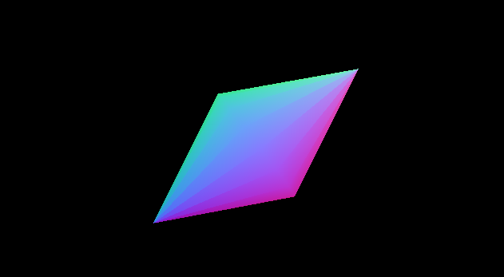

# Lathe

creates a 3D object by performing a revolution of a 2D profile around the Y axis

create a lathe object and pass it a profile 
``` javascript

    //import Lathe
    import Lathe from "./src/Lathe"

    //create a 2D profile
    let profile = [
        {x:0,   y:1},
        {x:.5,  y:0},
        {x:0,   y:-1}
    ]

    //create a Lathe object with the profile and a side count (min 3)

    let lathe = new Lathe(profile, 16)

    // then the buffers are available as:

    lathe.vertices = Float32Array // vertices as x/y/z 
    lathe.uvs = Float32Array // uvs coordinates as u/v 
    lathe.normals = Float32Array // *vertex* normals as normalized x/y/z
    lathe.indices = Array // face indices 

    //or you can create a Lathe instance and reuse it:

    let lathe = new Lathe()
    let result = lathe.compute( profile, sides )

    //and access the values as:
    vertices = result[0]
    uvs      = result[1]
    normals  = result[2]
    indices  = result[3]

```

should give you something like that
